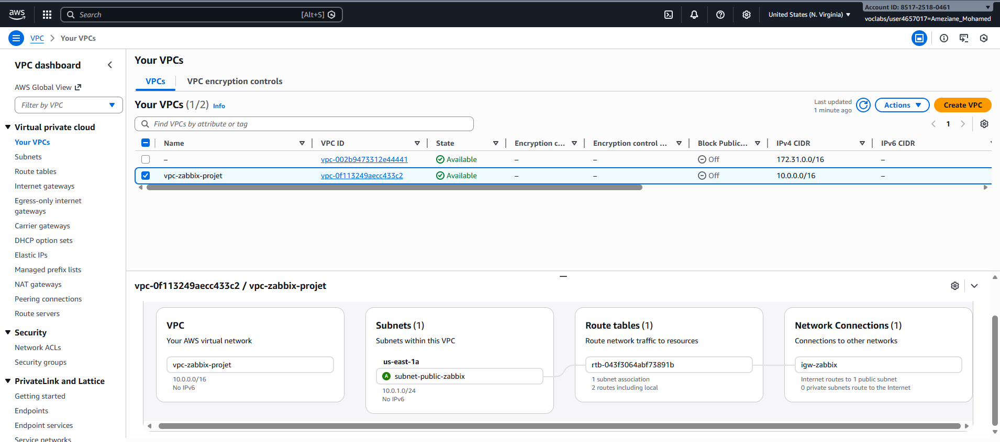
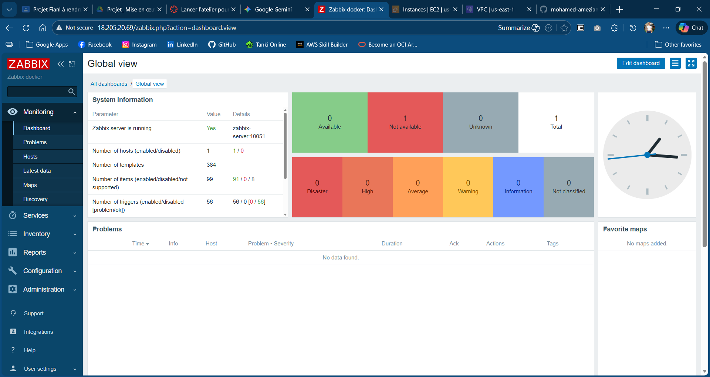

# Déploiement d'une Architecture de Supervision Zabbix sur AWS

Ce projet documente la mise en place d'une infrastructure de monitoring complète utilisant **Zabbix 6.0 LTS**, déployée sur le cloud **AWS** via **Docker**.

## 📋 Description
L'objectif est de superviser en temps réel un parc de serveurs hétérogène (Linux Ubuntu & Windows Server) au sein d'un VPC sécurisé.

**Architecture :**
* **Serveur :** Instance EC2 t3.large (Ubuntu) avec Docker & MariaDB.
* **Clients :** Instances EC2 (Linux & Windows).
* **Réseau :** VPC AWS, Security Groups configurés pour les ports 10050/10051.

## 🛠️ Prérequis
* Un compte AWS actif.
* Docker & Docker Compose v2 installés sur le serveur.
* Accès SSH et RDP aux instances.

## 🚀 Installation du Serveur (Docker)

1.  Cloner ce dépôt sur votre instance serveur :
    ```bash
    git clone [https://github.com/VOTRE_USER/zabbix-aws-project.git](https://github.com/VOTRE_USER/zabbix-aws-project.git)
    cd zabbix-aws-project/docker
    ```

2.  Lancer la stack Zabbix :
    ```bash
    docker compose up -d
    ```

3.  Accéder à l'interface Web : `http://IP_PUBLIQUE_SERVER`

## ⚙️ Configuration des Agents

### Agent Linux
1.  Installer l'agent :
    ```bash
    wget [https://repo.zabbix.com/zabbix/6.0/ubuntu/pool/main/z/zabbix-release/zabbix-release_6.0-6+ubuntu24.04_all.deb](https://repo.zabbix.com/zabbix/6.0/ubuntu/pool/main/z/zabbix-release/zabbix-release_6.0-6+ubuntu24.04_all.deb)
    sudo dpkg -i zabbix-release_6.0-6+ubuntu24.04_all.deb
    sudo apt update && sudo apt install zabbix-agent -y
    ```
2.  Éditer `/etc/zabbix/zabbix_agentd.conf` :
    ```ini
    Server=IP_PRIVEE_SERVEUR
    ServerActive=IP_PRIVEE_SERVEUR
    Hostname=Ameziane-Client-Linux
    ```

### Agent Windows
1.  Télécharger l'installateur MSI Zabbix 6.0 LTS.
2.  Lors de l'installation, renseigner l'IP Privée du serveur Zabbix.
3.  Ouvrir le port **10050** dans le pare-feu Windows.

## 📸 Aperçu

### Architecture Réseau


### Tableau de Bord Zabbix


## 👤 Auteur
**Mohamed Ameziane** - Étudiant en Big Data & Cloud Computing (ENSET Mohammedia).